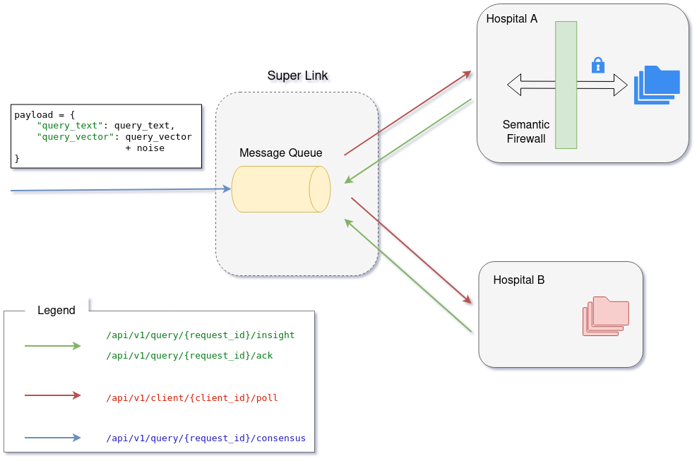
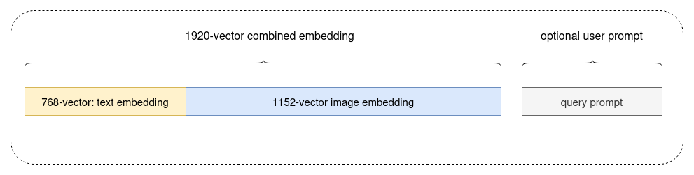

# 🛡️ Aethelgard: Decentralized Clinical Intelligence via Federated RAG

<p>
 <a></a>
 <a></a>
 <a></a>
</p>

**Aethelgard** is a lightweight, pure-pull Federated Retrieval-Augmented Generation (FedRAG) framework. 
It allows you to query highly sensitive, distributed vector databases (like clinical patient data) without ever moving 
raw data or opening inbound corporate firewalls.
Unlike traditional federated learning frameworks that focus on *training* models across silos, 
Aethelgard focuses strictly on *inference and routing*.

See the HQ video presentation [here](https://github.com/akaliutau/aethelgard/raw/main/docs/assets/Project_Aethelgard_demo.mp4)

<p align="center">


<em>Figure 1: The concept of UI for the Local Intelligence Node (`samples/demo_app.py`). The current variant is built on the basis of NiceGUI</em>
</p>


### ✨ Key Features

* **Pure-Pull Architecture:** Edge nodes use outbound asynchronous polling. **Zero inbound port-forwarding required** by IT departments.
* **100% Pluggable:** Ships with FastAPI and Redis defaults, but core abstractions allow easy swapping to gRPC, Kafka, AWS SQS, or GCP Pub/Sub.
* **Semantic Firewall Ready:** Designed to easily integrate local LLM verification (e.g., MedGemma) to sanitize vector search 
results before they are transmitted back to the global orchestrator.

### 🌌 The Vision

Solving the rare disease "Diagnostic Odyssey" requires more than a single application; it requires a paradigm shift in how 
clinical systems communicate. Healthcare is notoriously fragmented. Every hospital has a unique IT infrastructure, 
differing firewall policies, and strict, incompatible data governance laws (HIPAA, GDPR, etc.).

**We did not build an app. We built a protocol.**

Aethelgard is designed as a foundational **Federated Retrieval-Augmented Generation (FedRAG) Framework**. 
Applications are brittle and siloed; protocols scale. 
We engineered Aethelgard to act as the decentralized nervous system for clinical intelligence:
* **Agnostic to the UI:** Whether a hospital uses Epic, Cerner, or a custom legacy Electronic Health Record (EHR) system, 
  Aethelgard operates at the infrastructure layer, allowing local apps to hook into the global network seamlessly.
* **Adaptable to any IT Environment:** Built on strict Hexagonal Architecture, the core geometric and AI logic is completely 
  decoupled from the transport layer. 
* **Beyond Diagnostics:** While our primary demonstration focuses on rare disease diagnostics, the Aethelgard protocol can be 
  instantly adapted for pharmacovigilance (detecting rare adverse drug reactions globally), multi-center clinical trial matching, 
  and real-time epidemiological tracking - all without moving a single row of raw data.

### 🏗️ Architecture 

<p align="center">


<em>Figure 2: The abstract System Design of our protocol. Super-link is built on the basis of message queue. 
  For each component we have a pre-defined interface in our framework - see the classes in `/aethelgard`</em>
</p>

### 🏗️ How It Works (The Pure-Pull Workflow)

1. **Broadcast:** The global orchestrator drops a vectorized query into a secure mailbox (Broker).
2. **Pull:** The client node (behind a strict hospital firewall) wakes up on its 10-second heartbeat and asks, *"Do I have any mail?"*
3. **Local RAG:** The client executes a local vector search (e.g., LanceDB) and sanitizes the output.
4. **Upload:** The client pushes the safe, sanitized insight back to the orchestrator (super-link on the diagram).


### 🧮 Security Innovation: Empirical Noise vs. LDP

The most significant technical hurdle in Federated RAG is ensuring that transmitted semantic vectors cannot be reverse-engineered 
to reveal patient Protected Health Information (PHI). 

Our empirical evaluation of 1920-dimensional clinical vectors revealed that strict Local Differential Privacy (LDP) is 
mathematically incompatible with exact Top-1 retrieval utility in high-dimensional spaces. 
Applying standard LDP collapsed Top-1 retrieval accuracy to under 10%. 

To resolve this, Aethelgard utilizes an **Empirical Noise Strategy**. 
By applying a controlled Gaussian noise ($\sigma=0.2$) directly to the vectors, we degrade the raw vector similarity to 0.116 
(rendering exact inversion mathematically impossible) while perfectly preserving the relative spatial geometry. 

**Result:** 100% Top-1 Retrieval Accuracy across the network with zero raw data exposure.

👉 **[Privacy-Utility Trade-off Analysis](notebooks/LDP_and_Empirical_Noise_Parameter_Selection_Analysis.ipynb)** 
👉 **[Paper Draft](https://github.com/akaliutau/aethelgard/raw/main/docs/Privacy_Utility_Tradeoff_Analysis.pdf)** 


## 📂 Project Structure

The codebase is organized to separate infrastructure from implementation logic.

Here are the main components:
```text
aethelgard/
├── aethelgard/                   # The core Python package
│   ├── __init__.py
│   ├── core/                     # Abstract Base Classes & Core Utilities (The "Ports")
│   │   ├── broker.py             # Defines the BaseTaskBroker interface
│   │   ├── config.py             # Global logging and environment configuration
│   │   ├── llm_middleware.py     # Model-agnostic LLM routing (powered by LiteLLM)
│   │   ├── smartfolder.py        # SQLite-based state tracker for local file changes
│   │   └── transport.py          # Defines ServerTransport & ClientTransport interfaces
│   ├── brokers/                  # Concrete state managers (The "Adapters")
│   │   └── redis_broker.py       # Distributed task queue implementation using Redis
│   ├── firewall/                 # Security & Sanitization
│   │   └── litellm_firewall.py   # The MedGemma-powered generative sanitization adapter
│   ├── transports/               # Concrete network protocols
│   │   ├── fastapi_server.py     # REST/HTTP Orchestrator API implementation
│   │   └── httpx_client.py       # Async HTTP client for outbound node polling
│   └── node.py                   # The Edge Node heartbeat and execution loop
├── pipeline/                     # Scripts for GCP batch inference and data prep - 
│                                 #     only if a new dataset for experiments is needed
├── profiles/                     # .env configuration files for different network nodes
├── samples/                      # Demonstration scripts and interactive UIs
│   ├── demo_app.py             # The example of interactive clinician app built on NiceGUI
│   ├── test_integration.py       # Full network broadcast and consensus simulation for smoke tests
│   └── ...
├── tests/                        # Unit and integration test suite
├── docker-compose.yml            # Instantly spins up the Redis & FastAPI Orchestrator
├── Dockerfile                    # Container definition for the SuperLink server
├── pyproject.toml                # Modern Python packaging configuration
└── README.md```
```

## ⚡ Quick Start

### 1. Dev Environment Setup

Ensure you have the Google Cloud SDK installed and authenticated.

1. **Clone the repository**

```bash
git clone https://github.com/akaliutau/aethelgard.git
cd aethelgard
```

2. **Create and activate a Conda environment**

```bash
conda create -n aethelgard python=3.12 -y
conda activate aethelgard
```

3. **Install dependencies**

```bash
pip install -r requirements.txt
```

4. **Install ollama and Gemma/embedding models**

```bash
curl -fsSL https://ollama.com/install.sh | sh
ollama --version
ollama pull embeddinggemma
ollama pull gemma3:4b
# quick test
ollama run gemma3:4b "What is the capital of France?"
```
Cache Location: The model weights (typically a .gguf file) are cached securely on local disk:
** Linux: `/usr/share/ollama/.ollama/models`


NOTE: Extra steps for using Gated Models

* Accept the Terms: You cannot download these models anonymously. If they are hosted at Hugging Face, you must log in to Hugging Face, navigate to the model card page, 
  and review the Health AI Developer Foundations terms of use. Once you click to agree, your access request is processed immediately.
* Generate a Token: Go to your Hugging Face account settings and generate an Access Token (Read permission) and store in `.env` file under HF


5. (optional) **Run the Editable Install**

```bash
pip install -e .
```

6. Build all images

```bash
sudo docker build -t aethelgard-server:latest .
sudo docker images
```

7. (optional) **Re-Generate datasets from scratch**

Note: this step is only needed if you need to re-create dataset for your experiments.

Evaluating a privacy-preserving clinical network requires high-fidelity, multimodal data. To safely validate Aethelgard, we generated 
a highly realistic synthetic dataset distributed across our simulated hospital environments. 

The dataset is a curated subset (N=66) of the CheXpert chest X-ray competition dataset. We mapped these open-access images to generative, 
synthetic clinical admission notes. 

See more details and the instructions how to do that in [dedicated page](dataset/readme.md)


### 🚀 Running examples

First, we have to validate all workflow via running integration test

Run the following command to build and start the persistent Redis broker and super-link (the latter is available at http://localhost:8010/docs): 

```bash
sudo docker compose up --build --remove-orphans
sudo docker ps
```

It will start a container with redis, exposing `redis://localhost:6379` for requests.
A cache folder will automatically appear in your project directory containing the `/appendonlydir` data.

The super-link that should be available at `http://localhost:8010/docs`


In other terminal run the local node using profile for the Hospital B:

```bash
python samples/03_hospital_node.py --config profiles/node_b.env
```

If everything is green, run the demo app using profile for the Hospital A:

```bash
python samples/demo_app.py --config profiles/node_a.env
```
The UI page of application will automatically open in browser.


## 🧩 Core Framework Internals

Aethelgard is engineered strictly on Hexagonal Architecture (Ports and Adapters) to ensure high decoupling between the clinical logic and the infrastructure layer. This design makes the protocol adaptable to any hospital IT environment and allows for easy swapping of backend components.

### 1. The Orchestrator and Broker (State Management)
The central SuperLink orchestrator operates via a unified REST API (`FastAPIServer`) that maps directly to an abstract `BaseTaskBroker`. 
This abstraction allows the state management to be instantly swapped from the default Redis implementation to enterprise message queues like Kafka or GCP Pub/Sub without altering the core logic.
* **Broadcast**: The server drops a new query into the target clients' respective queues.
* **Poll**: Client nodes securely hit a polling endpoint to pull their pending tasks.
* **Insight & ACK**: Clients push successfully sanitized insights back to the server and explicitly acknowledge (`ACK`) task completion to safely clear the queue.

<p align="center">


<em>Figure 3: The super-link API layer. The current variant is built on the basis of FastAPI and uvicorn (`aethelgard/transports/fastapi_server.py`)</em>
</p>

### 2. The Edge Node (Pure-Pull Mechanism)
The `Node` class operates a secure, outbound-only heartbeat loop. By exclusively polling the transport layer for tasks, it completely eliminates the need for inbound corporate firewall ports.
* Upon receiving a task, the node executes a dependency-injected `search_fn` (acting as the local Semantic Firewall) against the incoming query vector.
* If a relevant clinical insight is found locally, it securely uploads the sanitized payload.
* The node strictly guarantees an `ACK` after successful processing (even if no matching data is found) to maintain network consensus integrity.

### 3. The Semantic Firewall 
The `LiteLLMFirewall` acts as the critical generative security layer between the local vector database and the outbound network. 
* It executes the local mathematical vector search using a provided retriever function (e.g., against LanceDB).
* The retrieved raw, highly sensitive clinical text is injected into a specialized Jinja prompt template.
* A local model—such as MedGemma 4B routed via our LiteLLM middleware—acts as an intelligent sanitizer to synthesize and extract only the relevant clinical protocol.
* The firewall strictly returns only the sanitized JSON payload and the similarity score, mathematically guaranteeing no raw PHI leaks.

### 4. Local State Synchronization
To seamlessly manage the local ingestion of EHR notes and medical imaging, Aethelgard implements a `SmartFolder` utility. It acts similarly to a local `git status` tracker, 
utilizing a lightweight SQLite database to track file modification times and sizes. 
This ensures that only newly added or modified clinical records are computationally embedded and fused into the local vector store.


## 📦 Protocol: Payload Structure

<p align="center">


<em>Figure 4: The structure of payload that is used in protocol; 1920-d combined embedding is mixed with noise before broadcasting, 
the user prompt is added as is. For text embeddings we are using `ollama/embeddinggemma` and for CXR images `google/medsiglip-448`. 
The core logic is in `pipeline/generate_embeddings.py`</em>
</p>

Aethelgard utilizes strict JSON schemas for all network communication to ensure type safety and seamless cross-node deserialization. The data exchange revolves around three primary payloads:

* **Clinical Query (`/broadcast`)**: When a doctor initiates a search, the orchestrator receives a payload containing the `query_text` 
  (the human-readable clinical question), the `query_vector` (the 1920-dimensional fused multimodal embedding, obfuscated with empirical noise), 
  and the `target_clients` (the list of hospital nodes to poll).
* **Insight Submission (`/insight`)**: When a remote node successfully finds a match and sanitizes it via the MedGemma Semantic Firewall, 
  it returns an object containing its `client_id` and the `sanitized_insight` (a JSON string containing the extracted clinical protocol devoid 
  of Protected Health Information).
* **Acknowledgment (`/ack`)**: A simple payload containing the `client_id`, sent by the edge node to clear the task from the orchestrator's 
   processing queue, regardless of whether a semantic match was found.


## 🚀 Future Roadmap: Scaling Aethelgard

Aethelgard is a foundation ready for enterprise scaling. Our immediate roadmap focuses on making the protocol completely invisible to the end-user while expanding its security and interoperability:

- [ ] **Native OS Daemon & Zero-Touch Ollama Integration:** Package the Aethelgard edge node as a lightweight, 
        headless background service (e.g., `systemd` for Linux, Windows Service). 
        This daemon will natively orchestrate local Ollama instances, dynamically loading and unloading MedGemma weights 
        and managing the inference lifecycle automatically - requiring zero technical overhead or terminal usage from clinicians.
- [ ] **Automated FHIR/HL7 EHR Ingestion:** Build native data pipelines to continuously ingest, vectorize, and index clinical notes and 
        imaging directly from standard Electronic Health Record (EHR) systems (like Epic and Cerner) in real-time, completely replacing manual data uploads.
- [ ] **Enterprise Message Brokers:** Expand the `BaseTaskBroker` port beyond Redis. Ship drop-in adapters for state-scale deployments using 
        **Apache Kafka**, **GCP Pub/Sub**, or **AWS SQS** with zero changes to the core geometric logic.
- [ ] **Hardware-Level Enclaves (TEE):** Integrate Trusted Execution Environments (e.g., Intel SGX, AMD SEV) for the SuperLink Message Queue 
        to guarantee mathematically and at the hardware level that the centralized routing infrastructure cannot inspect even the heavily obfuscated query vectors.
- [ ] **Specialized Multi-Agent Semantic Firewalls:** Evolve the single MedGemma instance into a local multi-agent system. Deploy specialized 
        sub-agents for distinct tasks (e.g., a Genomic Privacy Agent, a Radiographic Reasoning Agent) that debate and synthesize the final, hyper-secure outbound payload.
- [ ] **gRPC Multiplexing:** Upgrade the FastAPI/HTTPX transports to multiplexed **gRPC** to support low-latency, high-volume vector polling 
        across tens of thousands of concurrent hospital nodes globally.


## ⚖️ License

Project Aethelgard is open-source software distributed under the **MIT License**. 

By keeping the core routing and security protocol open and accessible, we aim to lower the barrier to entry for underfunded 
rural clinics and state-scale hospital networks alike. See the [LICENSE](LICENSE) file for more details.

---
*Built for the [MedGemma Impact Challenge](https://www.kaggle.com/competitions/med-gemma-impact-challenge/writeups/project-aethelgard-decentralized-clinical-intelli) organized by Google Research.* <br>
*Sharing knowledge to save lives.*


